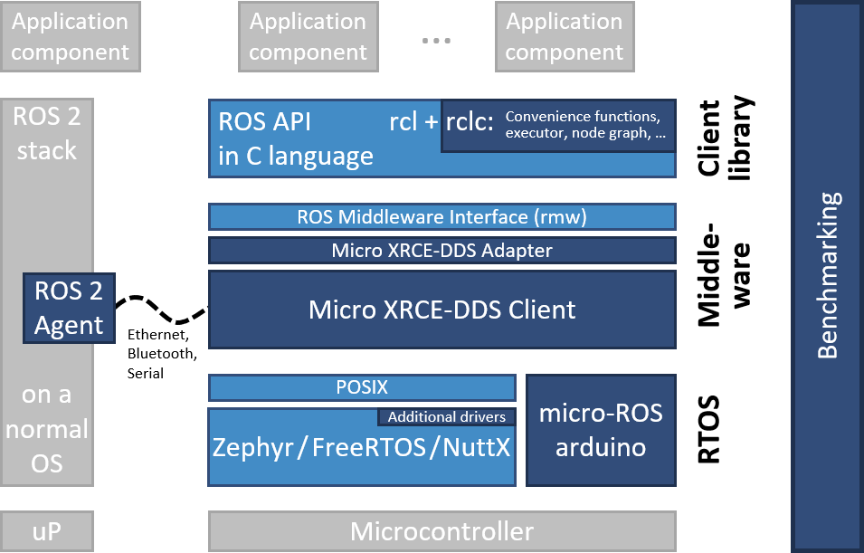

# Micro-XRCE-DDS-Client

## 1、Introduction

eProsima Micro XRCE-DDS is an open-source wire protocol that implements the OMG DDS for eXtremely Resource Constrained Environment standard (DDS-XRCE). The aim of the DDS-XRCE protocol is to provide access to the DDS Global-Data-Space from resource-constrained devices. This is achieved thanks to a client-server architecture, where low resource devices, called XRCE Clients, are connected to a server, called XRCE Agent, which acts on behalf of its clients in the DDS Global-Data-Space.

This repository is a package for RT-Thread which includes Micro XRCE-DDS Client library and provide the ROS2 topic public/subscribe ability.



### 1.1 Content Architecture

| Name | Description |
| ---- | ---- |
| docs  | Document folder |
| examples | Example folder |
| inc  | Header folder |
| src  | Source folder |

### 1.2 License

Apache license v2.0

### 1.3 Dependency

- RT-Thread 3.0+

## 2、How to Enable Micro-XRCE_DDS-Client

Enable Micro-XRCE-DDS-Client package in menuconfig at the belowing path:

```
RT-Thread online packages
    tools packages --->
        [*] Micro-XRCE-DDS-Client
```

> To enable examples, add `MICRO_XRCE_DDS_CLIENT_USING_EXAMPLE` in rtconfig.h

## 3、Usage

* [eProsima Document](https://micro-xrce-dds.docs.eprosima.com/en/latest/)
* [Micro-ROS Document](https://micro-ros.github.io/docs/concepts/middleware/Micro_XRCE-DDS/)
* For more documemt, please check `doc` folder.

## 4、Notice

This package is only tested on ROS2 Foxy, for other ROS distribution is not tested.

## 5、Communication

* Maintainer：Jiachi
