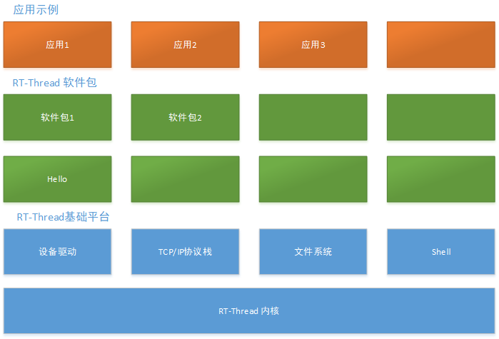

# Micro-XRCE-DDS-Client 介绍

Micro-XRCE-DDS-Client是Micro-ROS的中间层通信组件,是一个主要针对嵌入式设备实现OMG DDS通信的开源的有线通信协议。DDS-XRCE协议的目的是为嵌入式设备提供访问DDS Global-Data-Space的能力。

## 软件架构

该软件包主要包括icro-XRCE-DDS-Client的代码实现，作为桥梁跟ROS Agent进行通信。

### 软件架构图

如上 hello 软件架构图所示, 共分为 x 层，……，每一层描述。

### 功能

该软件包可以通过TCP,UDP,Serial链路来跟ROS进行消息的通信，主要通过发布/订阅机制。
通信链路的选择可以在`Micro-XRCE-DDS-Client/inc/uxr/client/config.h`进行配置
